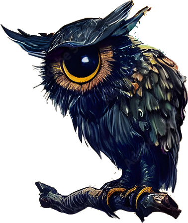

<div style="text-align: justify;">
<div style="display: flex; align-items: center; justify-content: space-between;">
    <h1>CyclopOwl Project</h1>
    
</div>

## Project Description

This project is focuses on building a rotative camera system using a Raspberry Pi Zero W. The system incorporates the following components :

- **Raspberry Pi Zero W**: It offers sufficient processing power for video streaming and motor control, along with built-in Wi-Fi for seamless wireless communication.
- **PiCamera**: A camera module specifically designed for use with Raspberry Pi, ensuring video capture.
- **Cooling Fan**: To maintain optimal operating temperatures, a cooling fan can be integrated, preventing overheating during prolonged use.
- **Two Servo Motors (blue)**: These motors allow for precise control of the camera's orientation.

## Setting Up the Project on Raspberry Pi Zero W

### Hardware

Connect the two servo motors to the Raspberry Pi GPIO pins as specified in your .env file (default pins are 12 and 13). Make sure to follow these connections:

#### Servo Motor 1 & 2

- Connect the **control wires** to GPIO pin 12 and 13 on the Raspberry Pi (or the ones you want, but do not forget to modify the values of PIN_SERVO_X and PIN_SERVO_Y in the .env file).
- Connect the **power wires** to 5V pins on the Raspberry Pi.
- Connect the **ground wires** to grounds (GND) pin on the Raspberry Pi.

#### Camera

Connect the Pi Camera to the Raspberry Pi using the camera interface (CSI) connector. Ensure that the camera is properly seated and the connector is locked in place.

### Software

Install Raspbian on the Raspberry Pi and connect it to the wifi. You will need Docker and Docker Compose installed, if you haven't installed them yet, follow the official Docker installation guide and Docker Compose installation guide. Clone the project repository to the Raspberry Pi using Git.

#### Prepare Environment Variables

Create an .env file in the src directory of the project (```cp src/.env.example src/.env```), and modify it depending on your preferences:

```
HOST="0.0.0.0"
PORT=8000
PIN_SERVO_X=12
PIN_SERVO_Y=13
```

#### Build and start the Docker Container

Navigate to the directory containing your docker-compose.yml file. Build the Docker container using:

```bash
docker compose -f /home/pi/CyclopOwl-Hardware/docker-compose.production.yaml up --build -d
```

The docker command will run the pigpiod daemon, which is required for GPIO control, and execute the application script.

## How to interact with the camera

After the application is up and running, you need obviously to create a client to interact with the camera.

### Streaming

You can access the camera streaming by connecting a client throught the socket. Use python socket package :

```python
import io
import struct
import socket
import time

# Connection to the camera
client = socket.socket()
client.connect((<rasp_ip>, 8000))

# Create file (read only bytes) to receive the data
conn = client.makefile('rb')

time.sleep(1)

# Enable the streaming by sending this command
client.send('{"action":"ENABLE_STREAMING","args":[]}'.encode())

# Calculate the size in bytes for a 4-byte unsigned integer (little-endian format)
size = struct.calcsize('<L')

# To receive images :
# To receive continuously images add :
# while True:
length_co = conn.read(size)

# Decode the image size
length = struct.unpack('<L', length_co)[0]

# Get the image data
raw_image = conn.read(length)

image = io.BytesIO()
image.write(raw_image)

# Then, the streaming can be disabled by sending this command :
client.send('{"action":"DISABLE_STREAMING","args":[]}'.encode())
```

### Rotation

To rotate the camera :

```python
import socket

# Connection to the camera
client = socket.socket()
client.connect((<rasp_ip>, 8000))

# cChange the args values -> [x,y]
client.send('{"action":"ROTATE","args":[0,0]}'.encode())
```
</div>

